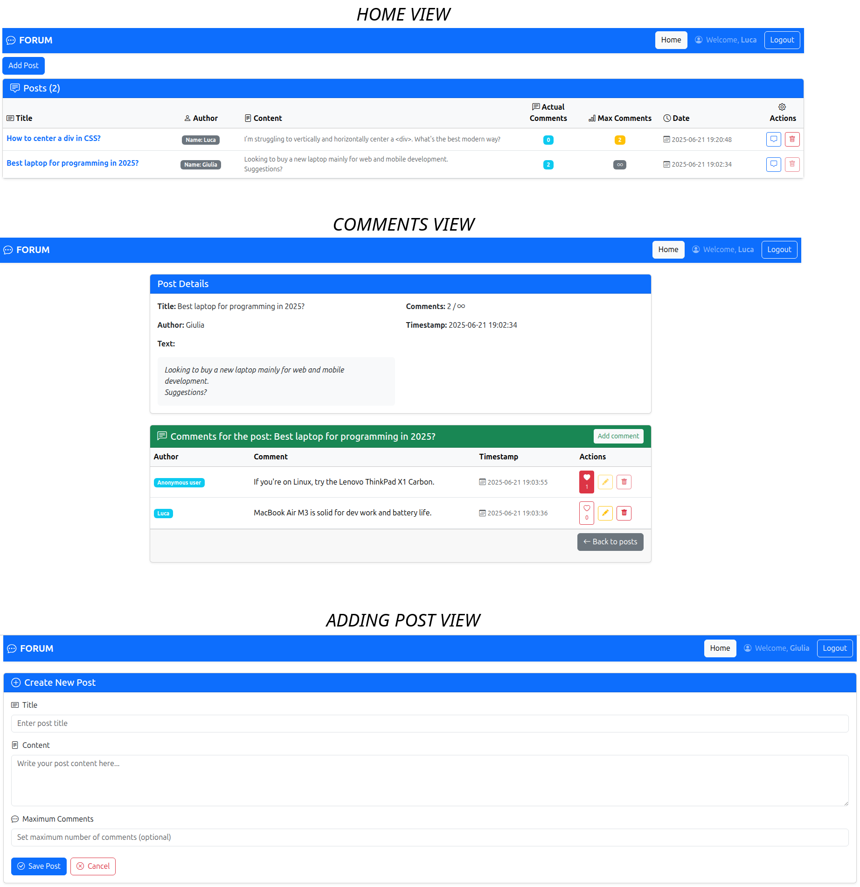

# Exam #1: "Forum"
## Student:  

## React Client Application Routes

**Route `/`**  
Displays all forum posts with title, author, multiline text, and timestamp, as well as the current and maximum number of comments. The available actions are **Comments**, which is always enabled and navigates to the post's comments page, and **Delete**, which is enabled only for the post author or an admin with 2FA. A **"Create New Post"** button is enabled only to authenticated users.

**Route `/add`**  
Displays a page for creating a new post, containing a form with the following fields: **Title**, which must be unique and is required; **Text**, which is multiline; and **Max Comments**, which is optional.

**Route `/posts/:postTitle/comments`**  
Displays the details of a specific post and its associated comments. The post information includes title, author, text, timestamp, and max/current number of comments. The comments are shown in a table listing each comment's author, text, timestamp, and available actions. Authenticated users can mark or unmark comments as interesting. Only the comment authors or an admin user with 2FA enabled can edit or delete comments. Any user can toggle a form to add new comments.

**Route `/login`**  
Displays the login page with standard username and password authentication. Admin users must complete a second step using TOTP-based 2FA. After successful login, users are redirected to the homepage.

**Route `*`**  
Displays a 404 error page when the user navigates to an unknown route.


## API Server


- GET `/api/posts`: retrive the complete list of posts
  - request parameters: none
  - response body content:
    ```json
    [
      {
        "title": "How to center a div in CSS?",
        "authorName": "Luca",
        "authorID": 1,
        "text": "I’m struggling to vertically and horizontally center a <div>. What's the best modern way?",
        "maximum_comments": 2,
        "number_actual_comments": 0,
        "timestamp": "2025-06-22 01:19:54"
      },
      {
        "title": "Best laptop for programming in 2025?",
        "authorName": "Giulia",
        "authorID": 4,
        "text": "Looking to buy a new laptop mainly for web and mobile development. Suggestions?",
        "maximum_comments": null,
        "number_actual_comments": 2,
        "timestamp": "2025-06-22 01:19:08"
      }
    ]
    ```

- POST `/api/posts`: create a new post
  - request body content:
    ```json
    {
      "title": "How to center a div in CSS?",
      "text": "I’m struggling to vertically and horizontally center a <div>. What's the best modern way?",
      "maximum_comments": 2
    }
    ```
  - response body content:
    ```json
    {
      "title": "How to center a div in CSS?",
      "authorName": "Luca",
      "authorID": 1,
      "text": "I’m struggling to vertically and horizontally center a <div>. What's the best modern way?",
      "maximum_comments": 2,
      "timestamp": "2025-06-22 01:19:54"
    }
    ```


- GET `/api/posts/:postTitle/comments`: retrieves the list of comments and related data for a specific post.
In `postInfo`, the API returns information related to the specified post.
In `comments`, it includes all comments associated with the post.
`number_of_likes` indicates the number of interesting flags for each comment.
`likeOfAuthUser` contains the flags set by the authenticated user.
`commentsNumber` provides the total count of comments for the post.
  - request parameters:
    - `postTitle`: string (path)
  - response body content:
    ```json
    {
      "postInfo": {
        "title": "Best laptop for programming in 2025?",
        "authorName": "Giulia",
        "authorID": 4,
        "text": "Looking to buy a new laptop mainly for web and mobile development. Suggestions?",
        "maximum_comments": null,
        "timestamp": "2025-06-22 01:19:08"
      },
      "number_of_likes": [
        {
          "commentID": 9,
          "count": 1
        }
      ],
      "comments": [
        {
          "id": 9,
          "text": "If you're on Linux, try the Lenovo ThinkPad X1 Carbon.",
          "timestamp": "2025-06-22 01:36:15",
          "authorID": null,
          "authorName": "Anonymous user",
          "postTitle": "Best laptop for programming in 2025?"
        },
        {
          "id": 6,
          "text": "MacBook Air M3 is solid for dev work and battery life.",
          "timestamp": "2025-06-22 01:32:59",
          "authorID": 1,
          "authorName": "Luca",
          "postTitle": "Best laptop for programming in 2025?"
        }
      ],
      "likeOfAuthUser": [
        {
          "postTitle": "Best laptop for programming in 2025?",
          "commentID": 9
        }
      ],
      "commentsNumber": 2
    }
    ```

- POST `/api/comments`: insert a new comment
  - request body content:
    ```json
    {
      "postTitle": "Best laptop for programming in 2025?",
      "text": "MacBook Air M3 is solid for dev work and battery life."
    }
    ```
  - response body content:
    ```json
    {
      "id": 6,
      "text": "MacBook Air M3 is solid for dev work and battery life.",
      "timestamp": "2025-06-22 01:32:59",
      "authorID": 1,
      "postTitle": "Best laptop for programming in 2025?"
    }
    ```


- PUT `/api/comments/:id`: update the text of a specific comment
  - request parameters:
    - `id`: integer (path)
  - request body content:
    ```json
    {
      "id": 6,
      "text": "MacBook Air M3 is solid for dev work and battery life. (updated)"
    }
    ```
  - response body content:
    ```json
    {
      "id": 6,
      "text": "MacBook Air M3 is solid for dev work and battery life. (updated)",
      "timestamp": "2025-06-22 01:32:59",
      "authorID": 1,
      "postTitle": "Best laptop for programming in 2025?"
    }
    ```

- DELETE `/api/comments/:id`: delete a specific comment
  - request parameters:
    - `id`: integer (path)
  - response body content:
    ```json
    1
    ```

- DELETE `/api/posts/:title`: delete a specific post
  - request parameters:
    - `title`: string (path)
  - response body content:
    ```json
    2
    ```

- POST `/api/:postTitle/comments/likes`: insert an interesting flag
  - request parameters:
    - `postTitle`: string (path)
  - request body content:
    ```json
    {
      "commentID": 9,
      "postTitle": "Best laptop for programming in 2025?"
    }
    ```
  - response body content:
    ```json
    "Like inserted"
    ```


- DELETE `/api/:postTitle/comments/likes?commentID=9`: delete a specific interesting flag
  - request parameters:
    - `postTitle`: string (path)
    - `commentID`: integer (query)
  - response body content:
    ```json
    1
    ```

- POST `/api/sessions`
  - request body content:
    ```json
    {
      "username": "luca@test.com",
      "password": "apple91"
    }
    ```
  - response body content:
    ```json
    {
      "id": 1,
      "username": "luca@test.com",
      "name": "Luca",
      "canDoTotp": false,
      "isTotp": false
    }
    ```

- POST `/api/login-totp`
  - request body content:
    ```json
    {
      "code": "128263"
    }
    ```
  - response body content:
    ```json
    {
      "otp": "authorized"
    }
    ```


- GET `/api/sessions/current`
  - request parameters: none
  - response body content (if authenticated):
    ```json
    {
      "id": 4,
      "username": "giulia@test.com",
      "name": "Giulia",
      "canDoTotp": true,
      "isTotp": true
    }
    ```
  - response body content (if not authenticated):
    ```json
    {
      "error": "Not authenticated"
    }
    ```

- DELETE `/api/sessions/current`
  - request parameters: none
  - response body content:
    ```json
    {}
    ```


## Database Tables

- Table `users`  
  - Stores user information for authentication and authorization.
  - Columns:
    - `id` (INTEGER, PK, AUTOINCREMENT) – Unique identifier for the user.
    - `email` (TEXT) – Email address.
    - `name` (TEXT) – Display name of the user.
    - `admin` (BOOLEAN) – Indicates if the user can gain admin privileges.
    - `salt` (TEXT) – Salt used in password hashing.
    - `password` (TEXT) – Hashed password.
    - `secret` (TEXT) – TOTP secret for two-factor authentication.

- Table `posts`  
  - Stores forum posts.
  - Columns:
    - `title` (TEXT, PK) – Unique title of the post.
    - `authorID` (INTEGER) – ID of the user who authored the post.
    - `text` (TEXT) – Content of the post.
    - `maximum_comments` (INTEGER) – Max number of comments allowed (nullable).
    - `timestamp` (DATE) – Date and time when the post was created.

- Table `comments`  
  - Stores comments made on posts.
  - Columns:
    - `id` (INTEGER, PK, AUTOINCREMENT) – Unique identifier for the comment.
    - `text` (TEXT) – Content of the comment.
    - `timestamp` (DATE) – Date and time when the comment was created.
    - `authorID` (INTEGER) – ID of the user who wrote the comment.
    - `postTitle` (TEXT) – Title of the post the comment is associated with.

- Table `likes`  
  - Stores all interesting flags on comments.
  - Composite Primary Key: (`authorID`, `commentID`, `postTitle`)
  - Columns:
    - `authorID` (INTEGER) – ID of the user who liked the comment.
    - `commentID` (INTEGER) – ID of the comment that was liked.
    - `postTitle` (TEXT) – Title of the post where the comment appears.


## Main React Components

- `App` (in `App.js`)
  - Root component of the application responsible for:
    - Global state management: authentication, error messages, posts, comments, and likes.
    - Routing using dedicated layouts for each route.
- `LoginWithTotp` (in `App.js`)
  - Handles the complete multi-step login flow with two-factor authentication (2FA):
    - If the user is logged in and 2FA is enabled:
      - Redirects to the 2FA page if not yet verified.
      - Otherwise, redirects to the home page.
    - If the user is not logged in:
      - Displays the standard login form.
- `GenericLayout` (in `Layout.js`)
  - Provides a consistent page structure for the app.
  - Includes:
    - Top navigation bar via the `Navigation` component.
    - Conditional error message alert.
    - `<Outlet />` element for rendering nested routes dynamically.
- `NotFoundLayout` (in `Layout.js`)
  - Displays a 404-style error page when the route is invalid.
  - Includes:
    - Clear error message.
    - Button to navigate back to the home page.
- `Navigation` (in `Navigation.js`)
  - Renders the top navigation bar of the application using Bootstrap.
  - Includes:
    - App branding and icon.
    - A "Home" button for returning to the main page.
    - User welcome message when logged in, with:
      - User’s name displayed.
      - 2FA indicator if active.
    - Login/Logout buttons based on authentication state.
- `PostTable` (in `PostList.js`): displays a responsive, styled table of forum posts using Bootstrap.
  - Features:
    - Defines the table header structure for displaying forum posts.
    - Delegates the rendering of each individual post to the `PostRow` component.
- `PostRow` (in `PostList.js`): renders a single table row for a post, showing metadata and actions.
  - Displays:
    - Title
    - Author name
    - Text content, formatted with preserved line breaks
    - Actual comment count
    - Max comment count (∞ for unlimited)
    - Timestamp
  - Actions:
    - View comments related to the post
    - Delete post 
      - Disabled if user is not author or is not TOTP-authenticated
- `PostForm` (in `PostForm.js`): form component for creating new posts.
  - Field to insert into the form:
    - Title (required)
    - Text/content (required)
    - Maximum number of comments (optional)
- `CommentSection` (in `Comments.js`): handles full comment functionality, including viewing, adding, editing, marking as interesting, and displaying post details.
  - Displays post details (title, author, text, timestamp, number of comments).
  - Shows a list of all comments in a responsive table.
  - Allows users to:
    - Add new comments via a collapsible form.
    - Users can edit or delete their own comments, or any comment if they are an admin authenticated with 2FA.
    - Mark/unmark comments as "interesting". (only authenticated user can perform this action)
  - Shows the number of "interesting" marks per comment (only for logged-in users).


## Screenshot



## Users Credentials

- email: luca@test.com, password: apple91, admin: false  
- email: martina@test.com, password: sunny22, admin: true  
- email: alice@test.com, password: book31, admin: false  
- email: giulia@test.com, password: cooldog, admin: true  
- email: andrea@test.com, password: jump88go, admin: false

